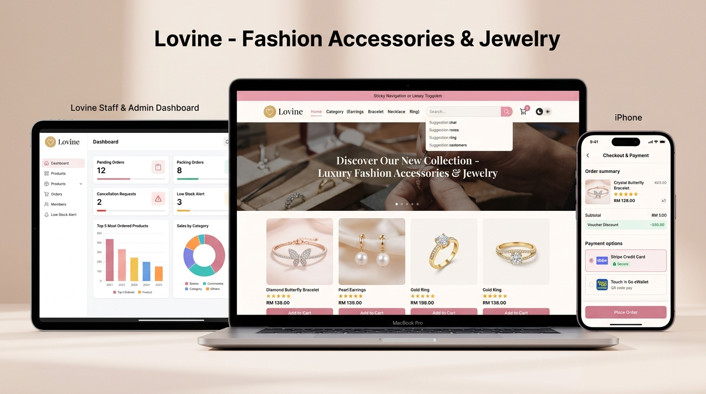
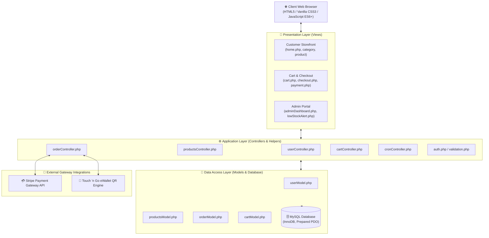

<div align="center">

  

  # ✨ Lovine — Fashion Accessories & Jewelry E-Commerce Platform

  <p align="center">
    <strong>An elegant, full-featured luxury jewelry e-commerce web platform built with PHP (MVC), MySQL, Vanilla CSS3, and JavaScript, featuring dynamic product filtering, interactive cart & checkout, dual payment gateways (Stripe & Touch 'n Go eWallet), real-time order tracking, and an analytics-driven staff management dashboard.</strong>
  </p>

  <p align="center">
    <a href="https://www.php.net/"></a>
    <a href="https://www.mysql.com/"></a>
    <a href="https://www.apachefriends.org/"></a>
    <a href="https://stripe.com/"></a>
    <a href="https://developer.mozilla.org/en-US/docs/Web/CSS"></a>
    <a href="https://developer.mozilla.org/en-US/docs/Web/JavaScript"></a>
    <a href="LICENSE"></a>
  </p>

  <p align="center">
    <a href="#-ui-showcase--core-screens">💻 UI Showcase</a> •
    <a href="#-key-features">✨ Key Features</a> •
    <a href="#-system-architecture">🏗 System Architecture</a> •
    <a href="#-design-system--color-palette">🎨 Design System</a> •
    <a href="#-tech-stack">🛠 Tech Stack</a> •
    <a href="#-project-structure">📁 Project Structure</a> •
    <a href="#-getting-started">🚀 Getting Started</a>
  </p>

</div>

---

## 💻 UI Showcase & Core Screens

<div align="center">
  
  <p><em>Figure 1: High-fidelity multi-device UI showcase of Lovine — 01. Staff & Admin Management Dashboard (iPad), 02. Customer Web Storefront & Luxury Jewelry Catalog (MacBook Pro), and 03. Mobile Responsive Cart & Stripe/Touch 'n Go Checkout (iPhone).</em></p>
</div>

<br/>

### 🔍 Screen-by-Screen Breakdown

| 01 • Luxury Web Storefront | 02 • Shopping Cart & Dual Checkout | 03 • Staff & Admin Dashboard |
| :---: | :---: | :---: |
| 💎 **Customer Discovery Experience** | 💳 **Seamless Transactions** | 📊 **Operations & Analytics Hub** |
| • **Sticky Brand Navigation**: Circular gold emblem, category menus, live search with AJAX auto-suggestions, and dark/light mode toggle.<br/>• **Hero Slider Carousel**: Dynamic promotional banners highlighting new seasonal arrivals and flash deals.<br/>• **Curated Jewelry Categories**: Filter by *Earrings, Bracelet, HairClaw, Necklace, and Ring*.<br/>• **Interactive Product Cards**: High-res multi-angle image gallery, star ratings, RM pricing, instant wishlist heart, and quick add-to-cart. | • **Dynamic Shopping Cart**: Real-time quantity adjustments, stock availability validation, and voucher code discount calculations.<br/>• **Multi-Address Book**: Manage multiple delivery addresses with default selection.<br/>• **Dual Payment Gateway**: Secure credit/debit card processing via **Stripe API**, alongside QR-based instant checkout via **Touch 'n Go eWallet**.<br/>• **Order Lifecycle & Tracking**: Real-time status tracker, cancelation workflows, order rating, and printable PDF receipts. | • **Executive KPI Cards**: Real-time counts for *Pending Orders, Packing Orders, Cancellation Requests*, and *Low Stock Alerts*.<br/>• **Interactive Visual Charts**: Top 5 Most Ordered Products (Bar Chart), Sales Distribution by Category (Donut Chart), and Revenue Trends (Week/Month/Year).<br/>• **Batch Product Management**: Import multiple jewelry items via CSV templates (`ProductTemplate.csv`) or manual single entry.<br/>• **Inventory Surveillance**: Automatic threshold monitoring with instant low-stock notifications. |

---

## 🚨 Problem & Solution

### The Challenge
- **Generic E-Commerce Experience**: Fashion and jewelry buyers expect an upscale, tactile, and visually cohesive luxury shopping experience that typical templates fail to provide.
- **Payment & Checkout Friction**: Limited local Malaysian payment options often cause cart abandonment during checkout.
- **Inventory & Operational Overhead**: Small-to-medium jewelry boutiques struggle with manual product listings, stock overselling, and lack of real-time sales visibility.

### The Lovine Solution
- **Curated Brand Identity**: Bespoke Soft Blush Pink (`#f1a2b8`) and Dusty Rose (`#de8ea4`) aesthetic with smooth micro-animations and seamless dark/light mode switches.
- **Dual Payment Flexibility**: Full Stripe payment integration for international cards paired with Touch 'n Go eWallet QR code payments for local Malaysian shoppers.
- **Automated Operations**: Built-in batch CSV product importation, automated low-stock threshold alerts, and self-cleaning cron processes for pending/expired transactions.

---

## ✨ Key Features

### 🛍️ Customer Front Store
- **Instant Search with Autocomplete**: Search products with real-time AJAX suggestions dynamically querying titles, tags, and categories.
- **Multi-Category Navigation**: Effortlessly browse through structured collections (Earrings, Bracelets, Hair Claws, Necklaces, Rings).
- **Product Details & Gallery**: High-definition image switcher, variant selection (finishes, lengths, sizes), and live stock availability badges.
- **Customer Wishlist**: Save favorite pieces to a personal wishlist and move items to cart with one click.
- **Address Book Management**: Save, edit, and organize multiple delivery addresses with default toggle.
- **Order History & Delivery Tracking**: Transparent visual timeline tracking order progression from *Pending → Paid/Packing → Shipped → Delivered*.
- **Post-Purchase Rating & Review**: Submit star ratings and photo feedback on purchased items.
- **Dual Dark / Light Mode**: Tailored color variables adapting smoothly between soft blush day mode and sleek midnight mode.

### 🛡️ Merchant & Staff Dashboard
- **Real-Time Operational Metrics**: Instant metrics on pending fulfillments, packing status, and return/cancellation tickets.
- **Sales Analytics & Visualizations**: Interactive data visualizers showing best-selling jewelry lines and category revenue distributions.
- **Low Stock Warning Center**: Configurable inventory threshold monitoring with one-click CSV export for restocking orders.
- **Batch CSV Product Upload**: Upload dozens of products and SKU variations at once using standard CSV templates.
- **Order Fulfillment Pipeline**: Update order status, review cancellation justifications, and inspect buyer details.
- **Role-Based Access Control**: Granular permission separation between customer accounts and staff/admin administrators.

---

## 🎨 Design System & Color Palette

Lovine adopts an artisanal, high-end luxury jewelry aesthetic anchored on soft blush tones, warm ivory, and rose gold accents:

| Token Name | Hex Code | Visual Swatch | Semantic Usage |
| :--- | :---: | :---: | :--- |
| `--primary` | `#f1a2b8` | `■` Soft Blush Pink | Brand accent, sticky navigation background, badge headers |
| `--primary-dark` | `#de8ea4` | `■` Dusty Rose Pink | Primary action buttons, section headlines, interactive states |
| `--primary-light`| `#ff859f` | `■` Sweet Candy Pink | Hover effects, badges, active indicator pills |
| `--secondary` | `#fff5f3` | `■` Light Peach Pink | Soft section backgrounds, input focus borders, highlights |
| `--light` | `#fff9f7` | `■` Soft Ivory White | Card surfaces, container backgrounds, clean canvas |
| `--dark` | `#1d2331` | `■` Deep Charcoal | Main readable typography, strong headers, icons |
| `--success` | `#10b981` | `■` Emerald Green | In-stock badges, payment confirmations, completed orders |
| `--warning` | `#f59e0b` | `■` Amber Orange | Low stock alerts, pending orders, notifications |

---

## 🏗 System Architecture

Lovine follows the **Model-View-Controller (MVC)** design pattern to cleanly separate presentation logic, business rules, and database operations:



---

## 🛠 Tech Stack

### 🖥️ Backend & Framework
| Technology | Description |
| :--- | :--- |
| **PHP 8.x** | Core server-side language using object-oriented MVC architecture |
| **MySQL / MariaDB** | Relational database with foreign key constraints and transactional integrity |
| **PDO (PHP Data Objects)** | Secure database abstraction layer with parameterized SQL statements |
| **Apache 2.4 (XAMPP)** | Local web server environment with URL rewriting |

### 🎨 Frontend & UI
| Technology | Description |
| :--- | :--- |
| **HTML5 & CSS3** | Clean semantic markup with modern Flexbox & Grid layouts |
| **Vanilla JavaScript (ES6+)** | Asynchronous AJAX fetching for search suggestions, cart updates, and modals |
| **Font Awesome 6** | Comprehensive icon library for navigation, actions, and social media |
| **Chart.js** | Canvas-based charts for admin dashboard sales analytics |

### 💳 Integrations & Libraries
| Component | Purpose |
| :--- | :--- |
| **Stripe PHP SDK** (`stripe-php/`) | Secure payment gateway for international credit/debit card transactions |
| **Touch 'n Go eWallet** | Malaysian local mobile QR code payment flow |
| **CSV Import / Export Engine** | Bulk inventory processing (`ProductTemplate.csv`) and low stock report generation |

---

## 📁 Project Structure

```
WebBased/
│
├── app/
│   ├── config/              ← Database connection & external API configurations
│   ├── controllers/         ← Business logic & request orchestration
│   │   ├── userController.php
│   │   ├── productsController.php
│   │   ├── orderController.php
│   │   └── cronController.php
│   ├── helpers/             ← Authentication, HTML renderers & input validation
│   ├── models/              ← Database queries and data access layer (PDO)
│   ├── sql/                 ← Database DDL migration scripts & seed data
│   └── views/               ← PHP template presentation views
│       ├── admin/           ← Staff and admin user listings
│       ├── category/        ← Category home and specific category views
│       ├── member/          ← Customer membership & auth forms
│       ├── order/           ← Order history, tracking, reviews, and admin orders
│       ├── product/         ← Product list, product details, low stock alerts
│       ├── shoppingCart/    ← Cart, checkout, payment, and receipt
│       ├── userProfile/     ← Profile, address book, wishlist, password reset
│       ├── adminDashboard.php ← Main Staff & Admin KPI Dashboard
│       ├── header.php       ← Customer sticky header with search & cart
│       ├── footer.php       ← Global customer footer
│       └── home.php         ← Main storefront landing page
│
├── public/                  ← Publicly accessible static assets
│   ├── css/                 ← 30+ modular Vanilla CSS stylesheets
│   ├── images/              ← Brand logos, jewelry photos, hero banners & UI assets
│   │   ├── Bracelet/        ← Bracelet product photography
│   │   ├── Earring/         ← Earring product photography
│   │   ├── HairClaw/        ← Hair claw product photography
│   │   ├── Necklace/        ← Necklace product photography
│   │   ├── Ring/            ← Ring product photography
│   │   ├── lovine_logo_circle.png ← Official circular brand logo
│   │   └── lovine_ui_showcase.jpg ← High-resolution UI showcase graphic
│   ├── js/                  ← Client-side scripts (cart, dark mode, validation)
│   └── ProductTemplate.csv  ← Sample CSV template for bulk product uploads
│
├── stripe-php/              ← Stripe official PHP library
├── index.php                ← Application entry point & router redirect
└── README.md                ← Project documentation & UI showcase
```

---

## 🚀 Getting Started

### Prerequisites

Ensure you have installed:
1. **XAMPP** (with PHP 8.0+ and MySQL / MariaDB)
2. A modern web browser (Chrome, Edge, Firefox, or Safari)

### Installation Steps

1. **Clone or Place Repository in XAMPP `htdocs`**:
   ```bash
   # Destination directory:
   cd C:/xampp/htdocs/WebBased
   ```

2. **Start Apache & MySQL in XAMPP Control Panel**:
   - Open **XAMPP Control Panel**.
   - Click **Start** for both **Apache** and **MySQL**.

3. **Import Database**:
   - Open phpMyAdmin in your browser: `http://localhost/phpmyadmin`
   - Create a new database named `webbased` (or the database specified in `app/config/`).
   - Import the SQL script located at:
     ```
     app/sql/database.sql
     ```

4. **Configure Database Credentials**:
   - Inspect and update database connection parameters in `app/config/` (Host: `localhost`, User: `root`, Password: ``, DB: `webbased`).

5. **Launch the Application**:
   - Open your browser and navigate to:
     ```
     http://localhost/WebBased/app/views/home.php
     ```
   - Access the Admin Dashboard at:
     ```
     http://localhost/WebBased/app/views/adminDashboard.php
     ```

---

## 🌐 Platform & Browser Compatibility

| Browser | Compatibility | Notes |
| :--- | :---: | :--- |
| **Google Chrome** | ✅ Supported | Fully optimized for desktop & mobile emulation |
| **Microsoft Edge** | ✅ Supported | Chromium-based full fidelity |
| **Mozilla Firefox** | ✅ Supported | Full Flexbox / Grid layout support |
| **Apple Safari** | ✅ Supported | Tested on iOS and macOS WebKit |

---

## 🤝 Contributing

1. Fork the repository
2. Create your feature branch (`git checkout -b feature/AmazingFeature`)
3. Commit your changes (`git commit -m 'Add some AmazingFeature'`)
4. Push to the branch (`git push origin feature/AmazingFeature`)
5. Open a Pull Request

---

## 📝 Conclusion

**Lovine** delivers a cohesive, end-to-end luxury e-commerce experience tailored specifically for fashion accessories and jewelry retail. By combining an intuitive customer-facing shopping journey, diverse local and international payment methods, and an automated staff back-office management system, Lovine demonstrates modern full-stack web engineering standards.

---

<div align="center">

  Made with ❤️ for luxury craftsmanship &nbsp;|&nbsp; Built with PHP, MySQL & Vanilla CSS

</div>
